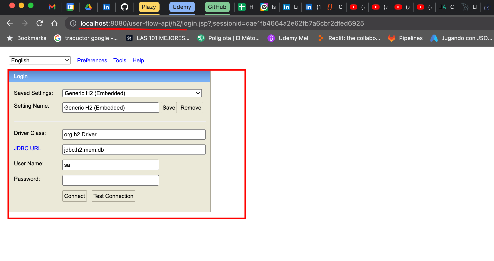

## User flow API

This project performs the registration of clients with their respective accounts and allows
movements to said accounts.

### Features.

- `url local`: http://localhost:8080/user-flow-api
- `DB`: H2, base de datos volátil.
- `Url DB local`: http://localhost:8080/user-flow-api/h2/
- `Context`: user-flow-api
- `Code building tool`: Gradle
- `Framework`: Spring boot 3.0.4
- `Language`: Java

### Available methods.

- `Create Customer: POST`: http://localhost:8080/user-flow-api/customers

Request:

```json
[
  {
    "name": "Jose Lema",
    "address": "Otavalo sn y principal",
    "telephone": "098254785",
    "password": "1234",
    "state": true
  },
  {
    "name": "Marianela Montalvo",
    "address": "Amazonas y NNUU",
    "telephone": "097548965",
    "password": "5678",
    "state": true
  },
  {
    "name": "Juan Osorio",
    "address": "13 junio y Equinoccial",
    "telephone": "098874587",
    "password": "1245",
    "state": true
  },
  {
    "name": "Angela Castillo",
    "address": "Calle falsa 123",
    "telephone": "317317317",
    "password": "1245",
    "state": true
  }
]
```

Response success: Http-Code: 200

```json
[
  {
    "name": "Jose Lema",
    "address": "Otavalo sn y principal",
    "telephone": "098254785",
    "password": "1234",
    "state": true,
    "gender": null,
    "age": 0,
    "identification": null
  },
  {
    "name": "Marianela Montalvo",
    "address": "Amazonas y NNUU",
    "telephone": "097548965",
    "password": "5678",
    "state": true,
    "gender": null,
    "age": 0,
    "identification": null
  },
  {
    "name": "Juan Osorio",
    "address": "13 junio y Equinoccial",
    "telephone": "098874587",
    "password": "1245",
    "state": true,
    "gender": null,
    "age": 0,
    "identification": null
  },
  {
    "name": "Angela Castillo",
    "address": "Calle falsa 123",
    "telephone": "317317317",
    "password": "1245",
    "state": true,
    "gender": null,
    "age": 0,
    "identification": null
  }
]
```

- `Update Customer - PUT`: http://localhost:8080/user-flow-api/customers/:idCustomer

Request:

```json
{
  "name": "Angela Suarez",
  "address": "Carrera 22 # 42 - 09 SUR UPDATE",
  "telephone": "12345000",
  "password": "123UPDATE",
  "state": false
}
```

Response success: Http-Code: 200

```json
{
  "name": "Angela Suarez",
  "address": "Carrera 22 # 42 - 09 SUR UPDATE",
  "telephone": "12345000",
  "password": "123UPDATE",
  "state": false,
  "gender": null,
  "age": 0,
  "identification": null
}
```

- `Delete Customer - DELETE`: http://localhost:8080/user-flow-api/customers/:idCustomer

Response success: Http-Code: 200

- `Get customer by id - GET`: http://localhost:8080/user-flow-api/customers/:idCustomer

Response success: Http-Code: 200

```json
{
  "name": "Jose Lema",
  "address": "Otavalo sn y principal",
  "telephone": "098254785",
  "password": "1234",
  "state": true,
  "gender": null,
  "age": 0,
  "identification": null
}
```

- `Create Account: POST`: http://localhost:8080/user-flow-api/accounts

Request:

```json
[
  {
    "accountNumber": 478758,
    "accountType": "AHORRO",
    "balance": 2000,
    "state": true,
    "customerId": 1
  },
  {
    "accountNumber": 225487,
    "accountType": "CORRIENTE",
    "balance": 100,
    "state": true,
    "customerId": 2
  },
  {
    "accountNumber": 495878,
    "accountType": "AHORRO",
    "balance": 0,
    "state": true,
    "customerId": 3
  },
  {
    "accountNumber": 496825,
    "accountType": "AHORRO",
    "balance": 540,
    "state": true,
    "customerId": 2
  },
  {
    "accountNumber": 585545,
    "accountType": "CORRIENTE",
    "balance": 1000,
    "state": true,
    "customerId": 1
  }
]
```

Response success: Http-Code: 200

```json
[
  {
    "accountNumber": 478758,
    "accountType": "AHORRO",
    "balance": 2000,
    "state": true,
    "customerId": null
  },
  {
    "accountNumber": 225487,
    "accountType": "CORRIENTE",
    "balance": 100,
    "state": true,
    "customerId": null
  },
  {
    "accountNumber": 495878,
    "accountType": "AHORRO",
    "balance": 0,
    "state": true,
    "customerId": null
  },
  {
    "accountNumber": 496825,
    "accountType": "AHORRO",
    "balance": 540,
    "state": true,
    "customerId": null
  },
  {
    "accountNumber": 585545,
    "accountType": "CORRIENTE",
    "balance": 1000,
    "state": true,
    "customerId": null
  }
]
```

- `Update account: PUT`: http://localhost:8080/user-flow-api/accounts/:idAccount

Request:

```json
{
  "accountType": "CORRIENTE",
  "balance": 0,
  "state": true
}
```

Response success: Http-Code: 200

```json
{
  "accountNumber": 225487,
  "accountType": "CORRIENTE",
  "balance": 0,
  "state": true,
  "customerId": null
}
```

- `Delete account - DELETE`: http://localhost:8080/user-flow-api/accounts/:idAccount

Response success: Http-Code: 200

- `Get account by id - GET`: http://localhost:8080/user-flow-api/accounts/:idAccount

Response success: Http-Code: 200

```json
{
  "accountNumber": 478758,
  "accountType": "AHORRO",
  "balance": 2000.00,
  "state": true,
  "customerId": null
}
```

- `Create movements: POST`: http://localhost:8080/user-flow-api/movements

Request: DEBIT

```json
{
  "accountNumber": 225487,
  "movementType": "DEBIT",
  "amount": 10
}
```

Request: CREDIT

```json
{
  "accountNumber": 225487,
  "movementType": "CREDIT",
  "amount": 12
}
```

Response success: Http-Code: 200

```json
{
  "accountNumber": null,
  "movementType": "DEBIT",
  "amount": 10
}
```

Response Error: Http-Code: 400

```json
{
  "timestamp": "2023-03-12T03:58:43.525874Z",
  "status": 400,
  "error": "Bad Request",
  "message": "Balance not available."
}
```

- `Get movements by id - GET`: http://localhost:8080/user-flow-api/movements/:idMovement

Response success: Http-Code: 200

```json
{
  "accountNumber": 225487,
  "movementType": "DEBIT",
  "amount": 10.00
}
```

- `Get report - GET`: http://localhost:8080/user-flow-api/reports/:customerId?startDate=2023-03-11&endDate=2023-03-11

Response success: Http-Code: 200

```json
[
  {
    "date": "2023-03-11",
    "customer": "Marianela Montalvo",
    "accountNumber": 225487,
    "accountType": "CORRIENTE",
    "initialBalance": 100.00,
    "state": true,
    "amount": -10.00,
    "balance": 90.00
  },
  {
    "date": "2023-03-11",
    "customer": "Marianela Montalvo",
    "accountNumber": 225487,
    "accountType": "CORRIENTE",
    "initialBalance": 90.00,
    "state": true,
    "amount": -10.00,
    "balance": 80.00
  },
  {
    "date": "2023-03-11",
    "customer": "Marianela Montalvo",
    "accountNumber": 225487,
    "accountType": "CORRIENTE",
    "initialBalance": 80.00,
    "state": true,
    "amount": -10.00,
    "balance": 70.00
  },
  {
    "date": "2023-03-11",
    "customer": "Marianela Montalvo",
    "accountNumber": 225487,
    "accountType": "CORRIENTE",
    "initialBalance": 70.00,
    "state": true,
    "amount": -10.00,
    "balance": 60.00
  },
  {
    "date": "2023-03-11",
    "customer": "Marianela Montalvo",
    "accountNumber": 225487,
    "accountType": "CORRIENTE",
    "initialBalance": 60.00,
    "state": true,
    "amount": -10.00,
    "balance": 50.00
  },
  {
    "date": "2023-03-11",
    "customer": "Marianela Montalvo",
    "accountNumber": 225487,
    "accountType": "CORRIENTE",
    "initialBalance": 50.00,
    "state": true,
    "amount": -10.00,
    "balance": 40.00
  }
]
```

### All endpoints:

Customer:

- `POST`: http://localhost:8080/user-flow-api/customers
- `PUT`: http://localhost:8080/user-flow-api/customers/:idCustomer
- `DELETE`: http://localhost:8080/user-flow-api/customers/:idCustomer
- `GET`: http://localhost:8080/user-flow-api/customers/:idCustomer

Account:

- `POST`: http://localhost:8080/user-flow-api/accounts
- `PUT`: http://localhost:8080/user-flow-api/accounts/:idAccount
- `DELETE`: http://localhost:8080/user-flow-api/accounts/:idAccount
- `GET`: http://localhost:8080/user-flow-api/accounts/:idAccount

Movements:

- `POST`: http://localhost:8080/user-flow-api/movements
- `GET`: http://localhost:8080/user-flow-api/movements/:idMovement

Report:

- `GET`: http://localhost:8080/user-flow-api/reports/:customerId?startDate=2023-03-11&endDate=2023-03-11

## ¿How to run the program?

STEPS:

- Clone the project from the following path using the 'git
  clone: https://github.com/angiekroll/user-flow-api
- Import the project from your IDE in this case intellij
- Compile the project
- Run
- Tester Potsman

### DOCKER:

STEPS:

1. The application is deployed on Docker, Docker must be installed on the local machine and the
   following commands should be executed to create the image and deploy it on the container:

    - docker build -t user-flow-api .
    - docker run -d -p 8080:8080 user-flow-api

2. The Postman collection is attached to all endpoints in the mail so it can be downloaded and used
   to make the corresponding requests.
3. There is no database script generated since, for the purposes of the technical test, a volatile
   H2 Database Engine was used, and the database is created with its respective tables in memory
   while the application is deployed. To access the H2 DB, once the application is deployed, you
   must go to the following route: 
   - http://localhost:8080/user-flow-api/h2/

## ¿How to connect to the DB?

- `JDBC`: jdbc:h2:mem:db
- `User Name`: sa
- `Password`:



